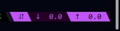

# fluximux

A minimal, reactive tmux network status + speedtest plugin.

`fluximux` shows live upload/download speeds in your tmux status bar and lets you trigger a full speedtest directly from tmux. It supports themed segments, configurable separators, custom colours, and distinct visual states for download and upload test stages.

---

### Standard internet traffic monitoring


### Monitoring during a speed test (<prefix> + q by default)


### No connectivity


## ✨ Features

- Live network speed (↓ / ↑ Mbps)
- Integrated `speedtest-cli`
- Separate download and upload stages
- Flashing indicator during active test
- Configurable keybinds
- Configurable separator styles
- Fully themeable colours
- Automatic interface detection
- Zero stdout noise

---

## 📦 Requirements

- `tmux`
- `speedtest-cli`
- Linux (reads `/proc/net/dev`)

Optional:
- Nerd Font (for Powerline-style separators)

---

## 🚀 Installation (TPM)

Add to your `.tmux.conf`:

```tmux
set -g @plugin 'TheAlgorMortis/fluximux'
```

The below will add the speedtest monitor to your status bar. 

WARNING: If you have other things in your status bar, you will need to put this string somewhere in there, but dont copy and paste, as it will remove whatever else you have.
```
set -g status-right "#(#{HOME}/.tmux/plugins/fluximux/scripts/flux_status.sh)"
```

Then add the below to allow the speed monitor to refresh every second.
```
set -g status-interval 1
```


Then run:

```
<prefix> + I
```

Or install manually by cloning into your tmux plugins directory.

---

## ⌨ Default Keybinds

| Binding        | Action        |
|---------------|--------------|
| `<prefix> + q` | Run speedtest |
| `<Alt> + q`    | Run speedtest |

Both bindings are configurable.

---

## 🔄 Speedtest Behaviour

When triggered:

1. Runs download-only test  
2. Runs upload-only test  
3. Suppresses all output  
4. Uses flag files to signal status  

## ⚙ Full Configuration Example including all configuration settings.

Paste this into your `.tmux.conf` to override defaults:

```tmux
##### FLUXIMUX CONFIGURATION

# Enable <prefix> binding
# Options: true | false
# Default: true
set -g @fluximux_enable_prefix_binds "true"

# Enable <Alt> binding
# Options: true | false
# Default: true
set -g @fluximux_enable_alt_binds "true"

# <prefix> key
# Default: q
set -g @fluximux_speedtest_key "q"

# <Alt> key
# Format: M-x
# Default: M-q
set -g @fluximux_alt_speedtest_key "M-q"

##### STATUS APPEARANCE

# Separator style
# Options: slanted | straight | pointed | rounded
# Default: slanted
set -g @fluximux_separator_style "slanted"

# Main background
# Default: #250025
set -g @fluximux_c_bg_main "#250025"

# Primary accent (normal state)
# Default: #C055F7
set -g @fluximux_c_purple "#C055F7"

# Accent when speedtest running
# Default: #EF4444
set -g @fluximux_c_red "#EF4444"

# Accent when no network
# Default: #FACC15
set -g @fluximux_c_yellow "#FACC15"

# Override logo (optional)
# Default: auto
set -g @fluximux_logo ""

##### NETWORK

# Manual interface override (eth0, wlan0, etc.)
# Default: auto-detect
set -g @fluximux_interface ""

# State directory
# Default: ~/.cache/fluximux
set -g @fluximux_state_dir ""
```

---

## 🧠 How It Works

- Reads RX/TX bytes from `/proc/net/dev`
- Calculates Mbps based on time delta
- Stores previous state in cache directory
- Uses flag files to detect:
  - `speedtest.running`
  - `speedtestdown`
  - `speedtestup`
- Renders themed tmux segments dynamically

---

## 🎯 Design Goals

- Minimal
- Fast
- No background daemons
- No polling loops
- No stdout spam
- Fully scriptable

---

## 🛠 Customisation Ideas

- Add separate keybinds for upload-only / download-only tests
- Add theme presets
- Integrate latency display
- Add Powerline fallback detection

Made for people who live inside tmux.
